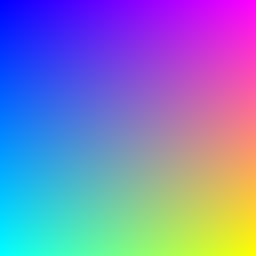

# Rusty_Raytracer

This is a work in progress Raytracer and accompanying maths library that is written in Rust and makes use of GitHub Actions to test and ensure that the workflow is always in a good state.

Here is the current output image that has been created from running the application using a the GitHub Action attached to this repository.

  

